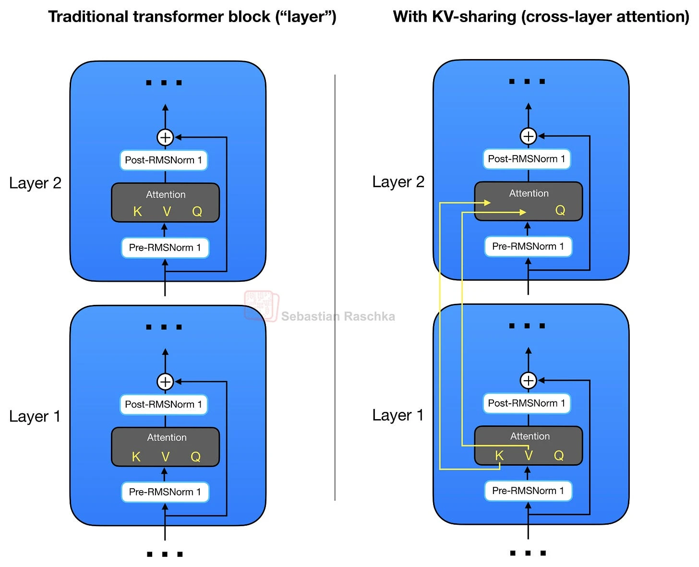
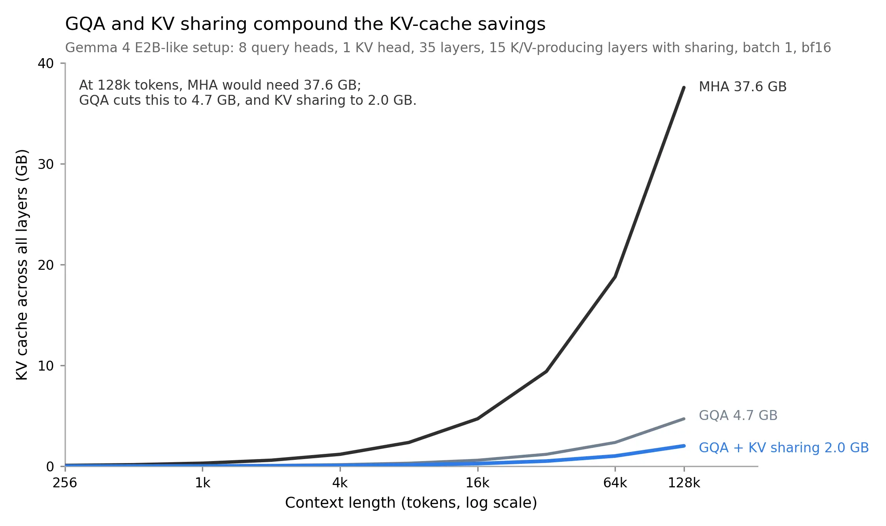
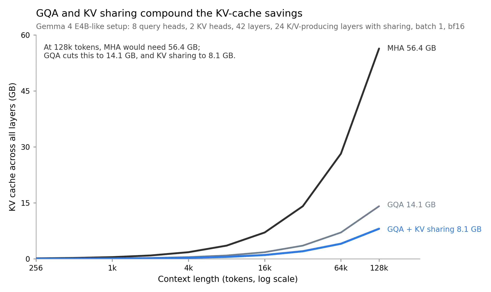

# Cross-Layer KV Sharing

This bonus material illustrates the memory savings when using cross-layer KV sharing together with a KV cache.

&nbsp;
## Introduction

In [../04_gqa](../04_gqa), we discussed Grouped-Query Attention (GQA), where several query heads share the same key and value heads. Cross-layer KV sharing applies a related idea across transformer layers.

Instead of computing a fresh key and value projection in every layer, later layers reuse K/V tensors from an earlier layer. They still compute their own queries, so each layer can form its own attention pattern. The main memory saving comes from storing fewer K/V tensors in the cache.

This idea is also called cross-layer attention. It is described in Brandon *et al.*, [Reducing Transformer Key-Value Cache Size with Cross-Layer Attention](https://arxiv.org/abs/2405.12981). Gemma 4 E2B and E4B use a related shared KV-cache scheme, which makes this a useful addition to the GQA, MLA, and SWA examples in this chapter.

&nbsp;



&nbsp;

In [Gemma 4](../../ch05/17_gemma4), KV sharing is combined with GQA or MQA and sliding window attention. For the simplified GPT example in this folder, we only implement the cross-layer KV-sharing part, so the code stays focused on the main mechanism.

The simplified rule used here is:

1. Early layers compute and cache their own K/V tensors.
2. Later layers reuse the most recent K/V tensors from an earlier producing layer.
3. All layers still compute their own query projections.

This reduces the number of K/V caches that grow with context length. The tradeoff is reduced model capacity because some layers no longer get their own K/V projections.

&nbsp;
## KV-Sharing Memory Savings

The usual KV-cache memory is computed as follows:

bytes = batch_size x seqlen x head_dim x n_kv_heads x n_layers x 2 (K,V) x bytes_per_elem

With cross-layer KV sharing, we replace `n_layers` with the number of K/V-producing layers:

bytes = batch_size x seqlen x head_dim x n_kv_heads x n_kv_producing_layers x 2 (K,V) x bytes_per_elem

You can use the [memory_estimator_kv_sharing.py](memory_estimator_kv_sharing.py) script in this folder to apply this to different model configs:

```bash
# Gemma 4 E2B-like setup
uv run memory_estimator_kv_sharing.py \
  --context_length 131072 \
  --emb_dim 2048 \
  --n_heads 8 \
  --n_layers 35 \
  --n_kv_groups 8 \
  --n_kv_producing_layers 15 \
  --batch_size 1 \
  --dtype bf16

# Gemma 4 E4B-like setup
# uv run memory_estimator_kv_sharing.py \
#   --context_length 131072 \
#   --emb_dim 2560 \
#   --n_heads 8 \
#   --n_layers 42 \
#   --n_kv_groups 4 \
#   --n_kv_producing_layers 24 \
#   --batch_size 1 \
#   --dtype bf16

==== Config ====
context_length         : 131072
emb_dim                : 2048
n_heads                : 8
n_layers               : 35
n_kv_groups            : 8
n_kv_producing_layers  : 15
batch_size             : 1
dtype                  : bf16 (2 Bytes/elem)
head_dim               : 256
GQA n_kv_heads         : 1

==== KV-cache totals across all layers ====
MHA total KV cache        : 37.58 GB
GQA total KV cache        : 4.70 GB
MHA + KV sharing          : 16.11 GB
GQA + KV sharing          : 2.01 GB
Ratio (MHA / GQA+sharing) : 18.67x
Savings vs MHA            : 94.64%
```

This is a Gemma 4 E2B-like setup. The 35 layers include 15 K/V-producing layers, and the remaining layers reuse earlier K/V tensors. For the E4B-like setup, the corresponding numbers are 42 total layers and 24 K/V-producing layers.

The savings are shown below for the E2B-like and E4B-like setups. For simplicity, these plots do not include additional savings from sliding window attention.

&nbsp;



&nbsp;



&nbsp;

You can reproduce similar plots via:

```bash
uv run plot_memory_estimates_kv_sharing.py --preset gemma4_e2b
uv run plot_memory_estimates_kv_sharing.py --preset gemma4_e4b
```

&nbsp;
## KV-Sharing Code Examples

The [gpt_with_kv_mha.py](gpt_with_kv_mha.py) and [gpt_with_kv_sharing.py](gpt_with_kv_sharing.py) scripts in this folder provide hands-on examples for comparing regular MHA with a cross-layer KV-sharing variant.

The easiest way to see the implementation details is to inspect a file diff between [gpt_with_kv_mha.py](gpt_with_kv_mha.py) and [gpt_with_kv_sharing.py](gpt_with_kv_sharing.py). The comments are intentionally kept similar so that the diff highlights the KV-sharing changes.

Note that the model is not trained and thus generates nonsensical text. However, you can use it as a drop-in replacement for the standard GPT model in chapters 5-7 and train it.

Also, this implementation uses the KV cache explained in [another bonus section](../03_kv-cache), so the memory savings are more pronounced.

```bash
uv run gpt_with_kv_mha.py \
--max_new_tokens 32768 \
--n_heads 24 \
--n_layers 12 \
--emb_dim 768
```

```bash
uv run gpt_with_kv_sharing.py \
--max_new_tokens 32768 \
--n_heads 24 \
--n_layers 12 \
--emb_dim 768 \
--n_kv_producing_layers 6
```

In this small GPT setup, the whole model still contains the same feed-forward layers and output head. The main memory difference is in how many attention layers store K/V tensors in the cache.
